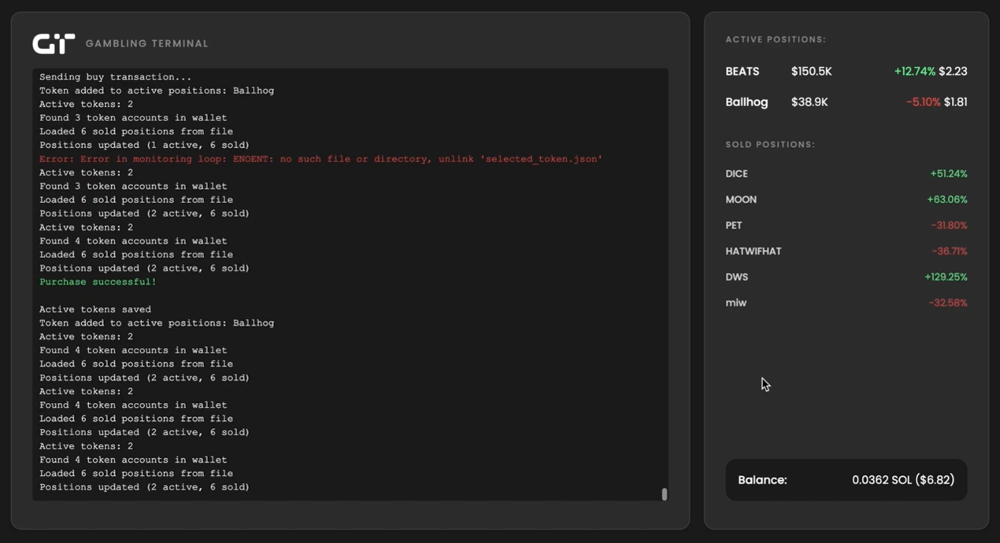

# Solana Trading Terminal

A high-frequency trading terminal for Solana tokens with real-time monitoring and automated trading strategies.



## Features

- 🚀 Real-time token discovery and analysis
- 💹 Automated trading with configurable parameters
- 📊 Live position monitoring and P&L tracking
- 🔄 Automatic stop-loss and take-profit execution
- 💼 Wallet balance monitoring
- 📈 Historical trades tracking

## Requirements

- Node.js v16 or higher
- npm or yarn
- Solana wallet with SOL for trading
- Access to a Solana RPC endpoint

## Installation

1. Clone the repository:
```bash
git clone https://github.com/GamblingTerminal/gt-bot.git
cd solana-trading-terminal
```

2. Install dependencies:
```bash
npm install
```

3. Edit a `config.js` file in the root directory with your settings:
```javascript
module.exports = {
    // Required settings
    PRIVATE_KEY: "your_wallet_private_key",
    RPC_ENDPOINTS: [
        "https://your-rpc-endpoint.com"
    ],
    
    // Trading parameters
    AMOUNT_TO_SPEND: 0.1,            // Amount of SOL to spend per trade
    TAKE_PROFIT_PERCENTAGE: 100,     // Take profit trigger (100%)
    STOP_LOSS_PERCENTAGE: -20,       // Stop loss trigger (-20%)
    
    // Advanced settings
    SLIPPAGE_BPS: 1000,             // Trade slippage in basis points (1000 = 10%)
    SELL_SLIPPAGE_BPS: 2000,        // Sell slippage in basis points (2000 = 20%)
    PRIORITY_FEE_SOL: 0.000001,     // Priority fee for transactions
    MIN_LIQUIDITY_USD: 1000,        // Minimum liquidity requirement
    SCAN_INTERVAL: 120000           // Token scanning interval (2 minutes)
}
```

## Configuration Settings

All settings are configured in `config.js`:

### Required Settings
- `PRIVATE_KEY`: Your wallet's private key
- `RPC_ENDPOINTS`: Array of Solana RPC endpoints (can specify multiple for fallback)

### Trading Parameters
- `AMOUNT_TO_SPEND`: Amount of SOL to spend per trade (default: 0.1)
- `TAKE_PROFIT_PERCENTAGE`: Take profit trigger (default: 100%)
- `STOP_LOSS_PERCENTAGE`: Stop loss trigger (default: -20%)

### Advanced Settings
- `SLIPPAGE_BPS`: Trade slippage tolerance in basis points (1000 = 10%)
- `SELL_SLIPPAGE_BPS`: Sell slippage tolerance in basis points (2000 = 20%)
- `PRIORITY_FEE_SOL`: Transaction priority fee in SOL
- `MIN_LIQUIDITY_USD`: Minimum token liquidity requirement in USD
- `SCAN_INTERVAL`: Time between token scans in milliseconds

## Usage

1. Start the terminal:
```bash
npm run start
```

2. Open your browser and navigate to:
```
http://localhost:3005
```

3. The terminal will automatically:
   - Scan for new tokens
   - Execute trades based on criteria
   - Monitor positions
   - Apply stop-loss and take-profit orders

## Interface Components

### Position Monitor
- Displays active trading positions
- Shows token symbols and current values
- Tracks profit/loss percentages
- Lists historical (sold) positions

### Wallet Info
- Shows current SOL balance
- Displays USD equivalent
- Updates in real-time

### Trading Log
- Real-time trading activity
- Token discovery notifications
- Transaction confirmations
- Error messages

## Trading Strategy

The terminal implements the following strategy:

1. **Token Discovery**
   - Continuously scans for new tokens
   - Analyzes market data and liquidity
   - Filters based on minimum liquidity requirements

2. **Buy Conditions**
   - Minimum liquidity threshold
   - Price momentum indicators
   - Market cap requirements
   - Trading volume analysis

3. **Position Management**
   - Automatic stop-loss execution
   - Take-profit order management
   - Real-time position monitoring
   - Price change tracking

4. **Sell Conditions**
   - Stop-loss hit (-20% default)
   - Take-profit reached (+100% default)
   - Liquidity drop protection
   - Automatic execution

## Data Storage

The terminal maintains several JSON files for data persistence:

- `active_tokens.json`: Currently held positions
- `sold_positions.json`: Historical trades with P&L
- `selected_token.json`: Currently selected token for purchase

## Error Handling

The terminal includes robust error handling for:

- Network connectivity issues
- RPC endpoint failures
- Transaction errors
- Invalid token data
- Insufficient liquidity
- Failed trades

## Security Considerations

1. **Private Key Storage**
   - Store your private key securely
   - Never commit .env file to version control
   - Use environment variables for sensitive data

2. **RPC Endpoints**
   - Use reliable RPC providers
   - Consider using multiple fallback endpoints
   - Monitor RPC rate limits

## Troubleshooting

Common issues and solutions:

1. **Transaction Failures**
   - Check SOL balance for fees
   - Verify RPC endpoint status
   - Ensure sufficient slippage tolerance

2. **Position Not Updating**
   - Check network connectivity
   - Verify token contract status
   - Confirm transaction confirmations

3. **Token Discovery Issues**
   - Check RPC endpoint connectivity
   - Verify minimum liquidity settings
   - Review token filtering criteria

## Contributing

1. Fork the repository
2. Create your feature branch
3. Commit your changes
4. Push to the branch
5. Create a new Pull Request

## License

This project is licensed under the MIT License.

## Disclaimer

Trading cryptocurrencies carries significant risk. This software is for educational purposes only. Always do your own research and trade responsibly. 
